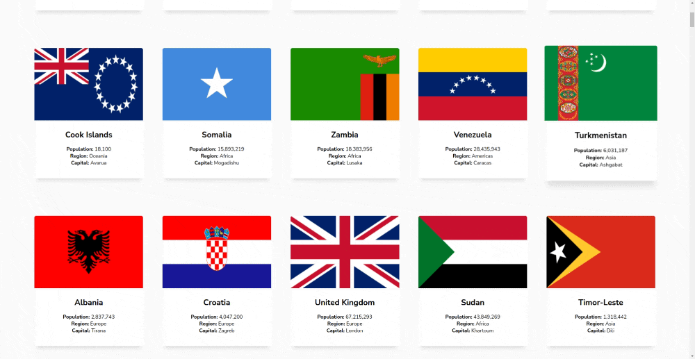
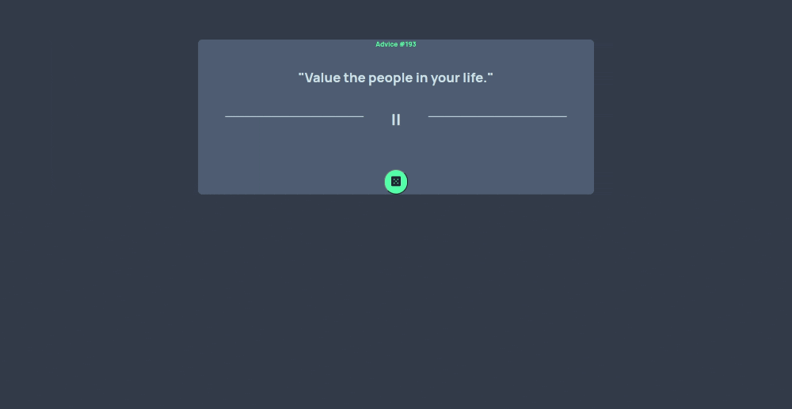
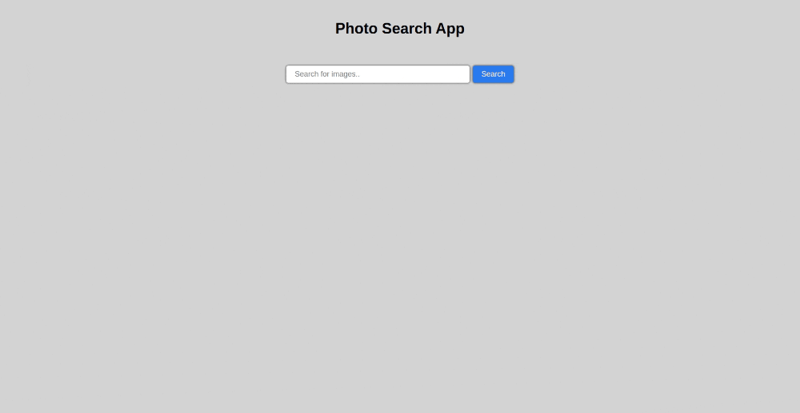

  
  
  
 

Whether meticulously fulfilling orders or operating complex machinery, I always had an eye for how things could be improved. Realizing the power of well-crafted software, I decided to harness my problem-solving skills and learn programming. I'm passionate about creating intuitive solutions that make a real difference.

See [my website](https://juricvlatko.netlify.app/) for more information!

<h1 align="center">Projects</h1>
<table bordercolor="#66b2b2">
  
  <tr>
    <td width="50%" valign="top">
      <h3 align="center">World Countries </h3>
         
        
         
        

          
    
  
      

        
<strong>HTML,CSS,Javascript,ReactJS</strong> - Craving knowledge of distant lands? Dive into any nation with a click! Uncover fascinating details like population, currency, and languages. Embark on a virtual voyage of discovery, one nation at a time. 

    </td>
    <td width="50%" valign="top">
      <h3 align="center">Travelingo</h3>
         
      
         
        

          
  
  
      

        
<strong>HTML,CSS,Javascript,ReactJS</strong> - Imagine a digital suitcase where you can list everything you need for your next adventure. Check off items as you pack, ensuring you never forget a thing. This website simplifies packing, letting you focus on the excitement, not the stress. 

    </td>
  </tr>
  
  <tr>
    <td width="50%" valign="top">
      <h3 align="center">Random Advice Giver</h3>
       
        
       
        

  
  
      

        
<strong>HTML,CSS,Javascript,ReactJS</strong> - Seeking guidance? Click for a touch of positivity and helpful advice, delivered at random. It's like having a wise friend always at your fingertips.

    </td>
    <td width="50%" valign="top">
      <h3 align="center">Photo Search Engine</h3>
         
        
         
        

          
  
  
      

        
<strong>HTML,CSS,Javascript</strong> - Looking for fresh inspiration? This website lets you discover random photos with every search. Find hidden gems, spark your creativity, and get lost in the beauty of the unexpected. It's a fun way to explore photography and see something new every time. 

    </td>
  </tr>
</table>

<h1 align="center">Technologies</h1>
 
   
    
    

<h1 align="center">Connect</h1>

 
  
  

  

